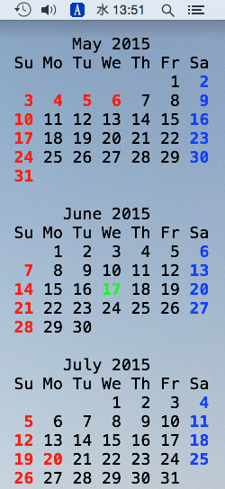
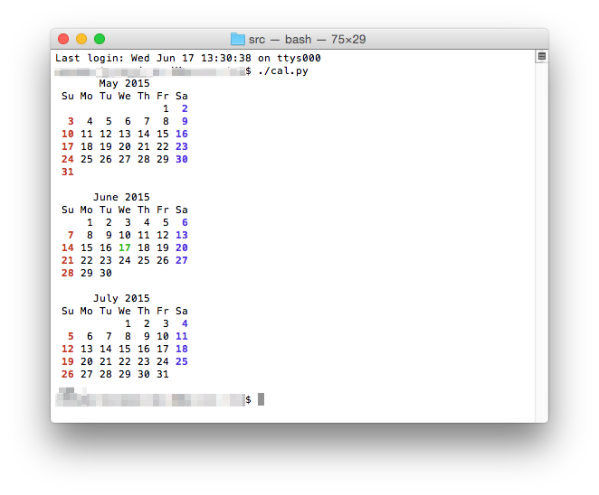
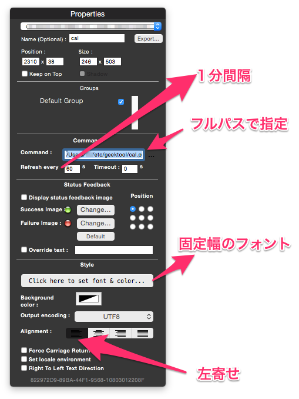

Calendar for GeekTool
=====================

Introduction
------------
休日・祭日に対応したカレンダーです．休日・祭日はGoogle Calendar を使用しています．
現在の前後一ヶ月（三ヶ月分）を表示します．

Installation
------------
1. srcを適当なフォルダーにコピー．
2. cal.SAMPLE.ini を cal.ini に複写またはリネームします．
3. cal.SAMPLE.ini の apiKey=... に自身のGoogleCalendarAPIキーを設定します．
4. chmod +x cal.py
5. ./cal.py を実行し以下のように表示されれば成功です．

6. GeekTool の設定

Dependencies
------------
* OS X (カラーコードを変えれば他のOSでもいけるかも)
* Python 2.7

License
-------
The code in this repository is available under the [MIT License](LICENSE).  
Copyright (c) 2015 Tro8.

Known issues
------------
none

Version history
------------
none
